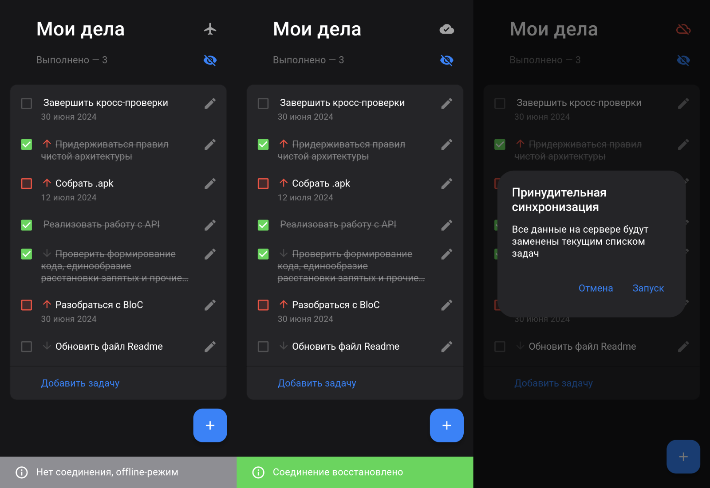

# Tasky — Todo List App

### Приложение для создания и отслеживания списка дел

## Доступные функции
- создание задач с возможностью указания приоритета и даты выполнения
- возможность свайпом вправо пометить дело выполненным, свайпом влево — удалить
- возможность скрыть/показать выполненные задачи
- поддержка тёмной и светлой тем в зависимости от системной
- хранение списка задач на устройстве пользователя
- автоматическая синхронизация данных с сервером
- возможность вызова принудительной синхронизации, например, в случае расхождения номеров ревизий клиента и сервера; запускается нажатием на иконку ошибки синхронизации (видна на предпоследнем скриншоте ниже)
- индикация режима работы приложения (online/offline) и статуса синхронизации
- поддержка deeplinks (подробнее ниже)

## Логика синхронизации
Это, в первую очередь, offline-first приложение. Поэтому сервер выполняет роль удалённого резервного хранилища, из которого можно восстановить данные при чистом запуске, например, после удаления данных приложения или на новом устройстве.

Порядок синхронизации:
- действия, изменяющие задачи (создание, изменение и удаление) в первую очередь выполняются в локальном состоянии приложении, а обновлённый список задач после каждого действия сохраняется на устройстве
- при наличии интернет-соединения изменяющие действия инициируют соответствующие API-запросы на сервер, в offline-режиме запросы не производятся
- при появлении соединения приложение по необходимости (при наличии локальных изменений) загружает текущий список задач с устройства на сервер
- если при запуске приложение находит на устройстве ранее сохранённые данные, то работает с ними; если данных нет, то происходит загрузка списка дел с сервера 

Волевым решением (с согласия ментора) подразумевается, что корректная работа одновременно с разных устройств на текущий момент не гарантируется

## Deeplinks
Поддерживается ссылка открытия экрана создания новой задачи: `tasky://tasky.app/task`. Работает и при незапущенном приложении. Можно проверить при помощи команды:
```
adb shell 'am start -a android.intent.action.VIEW \
    -c android.intent.category.BROWSABLE \
    -d "tasky://tasky.app/task"' \
    app.tasky
```

## APK
Загрузить .apk файл можно в разделе [releases](https://github.com/eshfield/tasky/releases)

## Локальный запуск
Для корректной работы при локальном запуске необходимо указать токен авторизации:
```
--dart-define=TOKEN=%YOUR_TOKEN%
```

## Скриншоты


