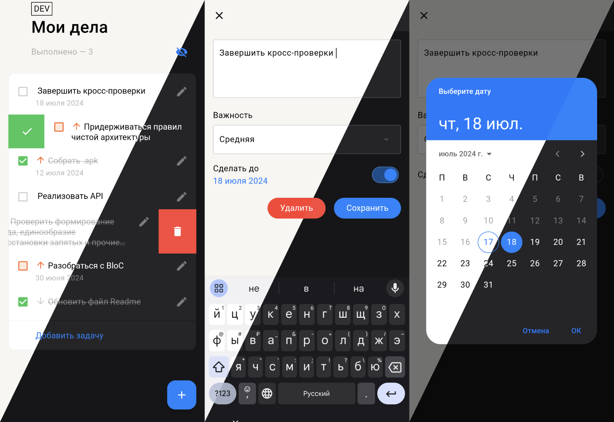
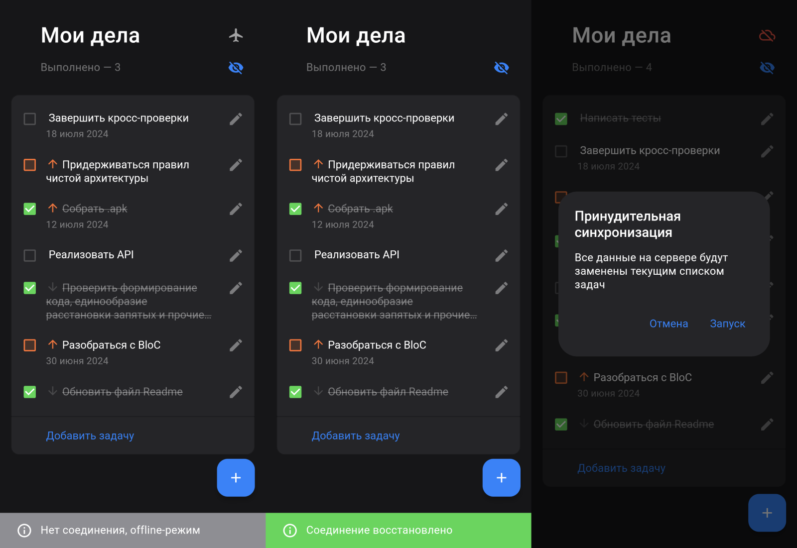
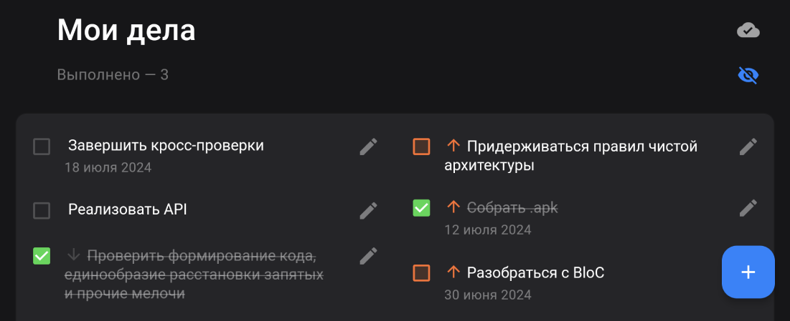

# Tasky — Todo List App

### Приложение для создания и отслеживания списка дел

## Доступные функции
- создание задач с возможностью указания приоритета и даты выполнения
- возможность свайпом вправо пометить дело выполненным, свайпом влево — удалить
- возможность скрыть/показать выполненные задачи
- хранение списка задач на устройстве пользователя
- автоматическая синхронизация данных с сервером
- возможность вызова принудительной синхронизации, например, в случае расхождения ревизий клиента и сервера; запускается нажатием на красную иконку ошибки синхронизации в шапке главного экрана (см. последний скриншот)
- поддержка deeplinks (подробнее ниже)

## Внешний вид
- поддержка тёмной и светлой тем приложения в зависимости от системной
- индикация режима работы приложения (online/offline) и статуса синхронизации
- анимации взаимодействия со списком задач на основе автоматического сравнения изменений в списке (`AutoAnimatedSliverList`); при этом анимации корректно проигрываются при переходах между экранами — виджет перед запуском анимации «дожидается» момента, когда он станет видимым 
- поддержка landscape-ориентации и планшетов: список задач перестраивается в две колонки
- отслеживание в реальном времени указанного в Firebase Remote Config цвета важности задач

## Прочее
- интеграция с Firebase-сервисами: Analytics, Crashlytics, Remote Configs
- настроен GitHub Actions CI с интеграцией с Firebase App Distribution

## Логика синхронизации
Это, в первую очередь, offline-first приложение. Поэтому сервер выполняет роль удалённого резервного хранилища, из которого можно восстановить данные при чистом запуске (например, после удаления данных приложения или на новом устройстве).

Порядок синхронизации:
- действия, изменяющие задачи (создание, изменение и удаление) в первую очередь выполняются в локальном состоянии приложении, а обновлённый список задач после каждого действия сохраняется на устройстве
- при наличии интернет-соединения изменяющие действия инициируют соответствующие API-запросы на сервер, в offline-режиме запросы не производятся
- при появлении соединения приложение по необходимости (при наличии локальных изменений) загружает текущий список задач с устройства на сервер
- если при запуске приложение находит на устройстве ранее сохранённые данные, то работает с ними; если данных нет, то происходит загрузка списка дел с сервера 

Волевым решением (с согласия ментора) подразумевается, что корректная работа одновременно с разных устройств на текущий момент не гарантируется

## Deeplinks
Поддерживается ссылка открытия экрана создания новой задачи: `tasky://tasky.app/task`. Работает и при незапущенном приложении. Можно проверить при помощи команды:
```
adb shell 'am start -a android.intent.action.VIEW \
    -c android.intent.category.BROWSABLE \
    -d "tasky://tasky.app/task"' \
    app.tasky
```

## APK
Загрузить .apk файл можно в разделе [Releases](https://github.com/eshfield/tasky/releases) или забрать у последнего запуска в [GitHub Actions](https://github.com/eshfield/tasky/actions/)

## Локальный запуск
Для корректной работы при локальном запуске необходимо указать токен авторизации:
```
--dart-define=TASKY_API_TOKEN=%YOUR_TOKEN%
```

## Тесты
Приложение располагает следующими тестами:
- unit тесты для сущностей: `TasksRepository`, `TasksCubit`, `SyncBloc`
- integration тесты: сценарий добавления новой задачи (подразумевается запуск на реальном устройстве или эмуляторе)

## Скриншоты





